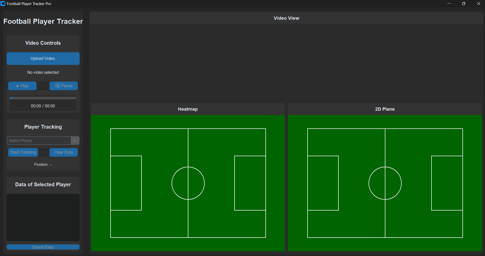

# Football Player Tracker
**AI-powered desktop application** that leverages computer vision and intelligent visualization to analyze football match videos and track players in real-time. 🎥⚽


Designed to analyze and track football players in match videos using YOLOv8 object detection and customized real-time visualization tools. Ideal for analysts, coaches, or researchers interested in player movement and performance metrics.


## Key Features

### Video Processing
- Upload and play full football match recordings  
- Real-time player detection powered by YOLOv8  
- Playback controls: play, pause, progress tracking  
- Frame-by-frame inspection for detailed analysis  

### Player Tracking
- Automatically detect and assign IDs to players  
- Select and track specific players individually  
- Monitor positions and velocities in real-time  
- Visualize movement paths directly on the field  

### Data Visualization
- Interactive 2D football pitch view  
- Live visualization of player trajectories  
- Heat map generation based on player movement  
- In-depth performance and statistics per player  

### Data Analysis
- Monitor player position over time  
- Calculate speeds and movement patterns  
- Export tracking data to CSV  
- Generate comprehensive match statistics  

---

 
## Video Demo

Watch a demonstration of the application in action:

https://github.com/user-attachments/assets/366068e0-343a-4eea-b11c-607ea9789da7

## Prerequisites


Ensure you have the following installed:

- Python 3.8+
- OpenCV (`cv2`)
- NumPy  
- Pillow (`PIL`)
- CustomTkinter  
- Ultralytics YOLO  
- SciPy  

## Getting Started

### Run the App:
```bash
python FootballMatch_AITracker.py
```

## How to Use

1. Click **"Upload Video"** and choose a football match recording  
2. Use the playback controls to navigate the video  
3. Select a player from the dropdown menu  
4. Toggle **"Track"** to start or stop tracking  
5. View real-time movement and statistics  
6. Export the collected tracking data if needed  

---

## Features in Detail

### Video Controls
- Upload local video files  
- Play/Pause functionality  
- Timeline progress bar with timestamp  
- Analyze video frame-by-frame  

### Player Tracking
- Player detection powered by **YOLOv8**  
- Assigns unique IDs for each player  
- Track selected players individually  
- Visual overlay of movement paths  

### Visualization
- Real-time player movement shown on a 2D pitch  
- Generate heat maps based on movement patterns  
- Live display of player statistics  

### Data Analysis
- Track player movement and speed over time  
- Identify movement zones and behavior patterns  
- Export all tracking and stats as CSV reports  

---

## Technical Details

- Built with **Python** and **CustomTkinter** for a clean modern interface  
- Integrates **YOLOv8** for real-time object detection  
- Efficient frame processing for smooth playback and analysis  
- Implements custom tracking algorithms for ID consistency  
- Uses **SciPy** for generating heat maps and data plots  

---

## Acknowledgments

- YOLOv8 by Ultralytics
- CustomTkinter for the modern UI components
- OpenCV community for video processing capabilities
